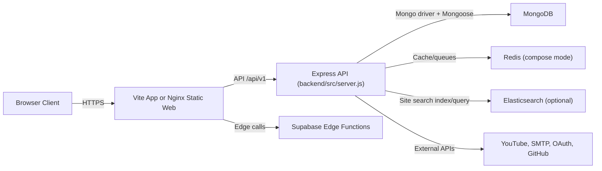
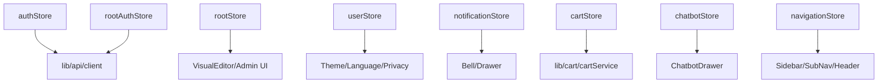
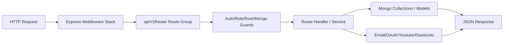

# The AOLIC Bangalore Platform

Production-oriented full-stack platform for The Art of Living International Center (Bangalore): public website, authenticated user experience, root/admin CMS workflows, search, chatbot, notifications, and deployment automation.

## Contents

- Overview
- Architecture
- Frontend deep map
- Backend deep map
- Data and integrations
- Run modes (local/dev/prod-like)
- Environment variables
- Build/test/verification
- Deployment
- Operations runbook
- Troubleshooting
- Security notes

## Overview

This repository contains one operational platform with multiple runtime surfaces:

- Web app (`React + Vite + TypeScript`) in `src`.
- Platform API (`Node + Express + MongoDB`) in `backend/src`.
- Optional chatbot/search adjunct server in `server`.
- Supabase edge functions and SQL assets in `supabase`.
- Deployment/runtime assets (`Docker`, `docker-compose`, `nginx`, GitHub Actions) at repo root.

Primary user domains implemented:

- Public: programs, events, services, explore, connect, seva/careers, search.
- Authenticated users: login/register, profile, cart, notifications, mood/activity features.
- Root/Admin: root auth, visual editor, admin dashboard/actions, content/search operations.

## Architecture



### Runtime entry points

- Frontend boot: `src/main.tsx` -> `src/App.tsx`.
- Backend boot: `backend/src/server.js` (active API runtime).
- Dev orchestrator: `scripts/dev-orchestrator.mjs` (`npm run dev`).
- Compose stack: `docker-compose.yml`.

## Frontend Deep Map

### App shell and providers

Global wrappers are in `src/App.tsx`:

- `QueryClientProvider` (React Query),
- Router (`BrowserRouter`),
- SEO + analytics wrappers,
- onboarding modals and route sync,
- shared UI overlays/toasters.

Primary layout component: `src/components/layout/MainLayout.tsx`

- desktop sidebar,
- sticky header,
- page content slot,
- footer,
- mobile bottom bar,
- optional chatbot drawer.

### Route tree (major)

Implemented in `src/App.tsx`.

- `/` home
- `/auth/*` auth pages
- `/programs/*` program listing/details/fallback
- `/services/*` service listing/details
- `/events/*` listing/upcoming/ongoing/past/detail/youtube
- `/explore/*` about/mission/articles/videos/testimonials
- `/connect/*` contact/support/faqs
- `/seva-careers/*`
- `/settings`, `/profile`, `/u/:userId`
- `/root/*` root operator auth/editor/dashboard
- `/admin/*` role-protected admin pages
- `/p/:slug` CMS-rendered dynamic page

### Feature systems

- Auth + session bootstrap: `src/stores/authStore.ts`, `src/lib/api/auth.ts`.
- Root auth session: `src/stores/rootAuthStore.ts`.
- Root editor/content ops state: `src/stores/rootStore.ts`.
- Search: `src/components/search/SearchModal.tsx`, `src/lib/search/*`.
- Chatbot UI + flow: `src/components/chatbot/*`, `src/hooks/useChat.ts`.
- Notifications: `src/stores/notificationStore.ts`, `src/components/notifications/*`.
- Cart: `src/stores/cartStore.ts`, `src/lib/cart/*`.
- i18n: `src/lib/i18n.ts`.
- SEO: `src/components/seo/*`.

### State graph (high-level)



## Backend Deep Map

### API runtime and middleware pipeline

Backend service is `backend/src/server.js` using app composition from `backend/src/app.js`.

Middleware order in `backend/src/app.js`:

1. `helmet`
2. `cookie-parser`
3. `cors`
4. raw admin media upload mount
5. JSON parser + bad JSON handler
6. static `/uploads`
7. API mount (`/api/v1` by default)
8. `/healthz`
9. 404 handler
10. global 500 handler

### API route groups

Mounted by `backend/src/routes/apiV1Router.js`.

- `/root` public + root auth routes
- `/auth` user authentication/session routes
- `/users` profile/resume/public profile
- `/mood` mood entries/feedback
- `/carts` cart endpoints
- `/admin` admin endpoints (auth + role + production 2FA checks)
- `/oauth` social login callbacks
- `/editor` root-protected page editor APIs
- `/deploy` root-protected GitHub deploy API
- `/events` event interest endpoints
- `/notifications` user notifications
- `/search` site search + click tracking
- `/geo`, `/preview`, `/youtube/v3`, `/youtube/rss` utility/integration routes

### Backend flow (request lifecycle)



### Security controls

Major controls visible in backend code:

- JWT access + refresh model, refresh rotation/revocation logic.
- Root auth separated from regular user auth.
- Role-based authorization middleware.
- Production-focused admin 2FA requirement middleware.
- Helmet + CORS + cookie protections.
- Brute-force/rate-limiting and lockout controls on critical auth/search endpoints.

## Data and Integrations

### Datastores

- MongoDB: primary operational datastore for API domain.
- Redis: compose/runtime dependency for selected flows.
- Elasticsearch: optional site search backend (`/api/v1/search/*` path).
- Supabase SQL/edge layer: edge functions, schema, migrations.

### Search and content

- Frontend search experience: `Fuse.js` with advanced UI (`src/lib/search`, `src/components/search/SearchModal.tsx`).
- Backend site search endpoints: `backend/src/routes/searchRoutes.js`.
- Optional Elasticsearch integration in backend services.

### External integrations

- SMTP mail flows (verification/reset and test scripts).
- OAuth providers (Google/Facebook/GitHub/Apple paths in backend routes/env).
- YouTube API/RSS ingestion paths.
- GitHub deploy integration endpoint for root workflows.
- Supabase edge functions:
  - `supabase/functions/platform-chat`
  - `supabase/functions/content-ingest`
  - `supabase/functions/sync-to-sheets`
  - `supabase/functions/admin-verify`

## Run Modes

## 1) Recommended local mode (one command)

```bash
npm run dev
```

Behavior:

- Runs `scripts/dev-orchestrator.mjs`.
- Ensures backend readiness and starts:
  - API on `http://localhost:4000`
  - frontend on `http://localhost:8080`
- Attempts Docker Mongo/Redis when available; can use local Mongo or Atlas based on env.

## 2) Frontend-only mode

```bash
npm run dev:web
# or
npm run dev:vite
```

- Runs Vite on port `8080`.
- Proxy config in `vite.config.ts` targets backend at `http://127.0.0.1:4000` for `/api` and `/uploads`.

## 3) Backend-only mode

```bash
cd backend
npm run dev
```

- Starts `backend/src/server.js` with nodemon watch.
- Health endpoint: `http://localhost:4000/healthz`.

## 4) Docker compose full stack

```bash
docker compose up -d --build
```

From `docker-compose.yml`:

- mongo `27017`
- redis `6379`
- elasticsearch `9200`
- backend `3000`
- web/nginx `8080` (container port 80)

## Environment Variables

Use templates:

- Root frontend: `.env.example`
- Backend: `backend/.env.example`

Never commit local secret files:

- `.env`
- `backend/.env`

### Important runtime notes

- Local orchestrator and Vite proxy assume backend on `:4000`.
- Compose backend uses `:3000` in containerized mode.
- Keep frontend `VITE_API_BASE_URL` aligned with your chosen mode.

## Build, Test, Verification

Root commands (`package.json`):

```bash
npm run lint
npm run build
npm run test
npm run verify:backend
```

Backend commands (`backend/package.json`):

```bash
cd backend
npm run verify:imports
npm run test:smtp
npm run reindex:search
```

Operational checks:

```bash
node ops/smoke_test.mjs
node scripts/verify-auth-login.mjs
```

## Deployment

CI/CD workflow: `.github/workflows/deploy.yml`

Current flow:

1. Trigger on push to `main`.
2. CI stage:
   - install deps,
   - frontend build,
   - backend verify (`npm run verify:backend`).
3. Deploy stage:
   - SSH to EC2,
   - pull latest `main`,
   - docker compose build/up,
   - prune old images.

Nginx behavior (`nginx/default.conf`):

- SPA fallback to `index.html`.
- gzip enabled.
- long cache headers for `/assets/*`.
- optional reverse-proxy block for API (commented template).

## Operations Runbook

### Backups

Mongo backup/restore scripts:

- `ops/mongo/backup_to_s3.sh`
- `ops/mongo/restore_from_s3.sh`

### Local ops helpers

- `ops/run_local.sh` (compose dev helper)
- `ops/smoke_test.mjs` (smoke validation)

### Search maintenance

- Backend search reindex script: `backend/scripts/reindex-site-search.mjs`

## Troubleshooting

- **Frontend loads but API fails**
  - Verify `http://localhost:4000/healthz`
  - Confirm Mongo reachable and `mongoReady: true`
  - Check `VITE_API_BASE_URL` / proxy mode alignment.
- **Auth/session issues**
  - Validate JWT/refresh secrets in backend env.
  - Ensure cookie/domain/origin config aligns with chosen host/port.
- **Compose startup issues**
  - Inspect service health in `docker-compose.yml`.
  - Verify Docker daemon and available local ports.
- **Search anomalies**
  - Check `/api/v1/search/health`
  - Validate Elasticsearch URL/index envs.

## Security Notes

- Rotate all secrets in production.
- Enable strict env management and least-privilege IAM/keys.
- Keep `.env` files out of Git.
- Review root/admin credential and 2FA policies before public release.
- Validate CORS and cookie settings for your deployment domain.

## Repository Structure (top-level)

```text
backend/                 Express API, auth, editor/admin APIs, services
src/                     React frontend application
public/                  static assets and index data
server/                  optional adjunct chat/search server
scripts/                 dev orchestration and verification scripts
ops/                     operational scripts (run helpers, backup/restore, smoke tests)
supabase/                edge functions, SQL schema/migrations
database/migrations/     legacy SQL migration assets
nginx/                   nginx runtime configuration
docker-compose.yml       compose stack definition
docker-compose.dev.yml   compose dev override
```

## License

Proprietary project repository. Define organizational licensing/distribution policy before external sharing.
